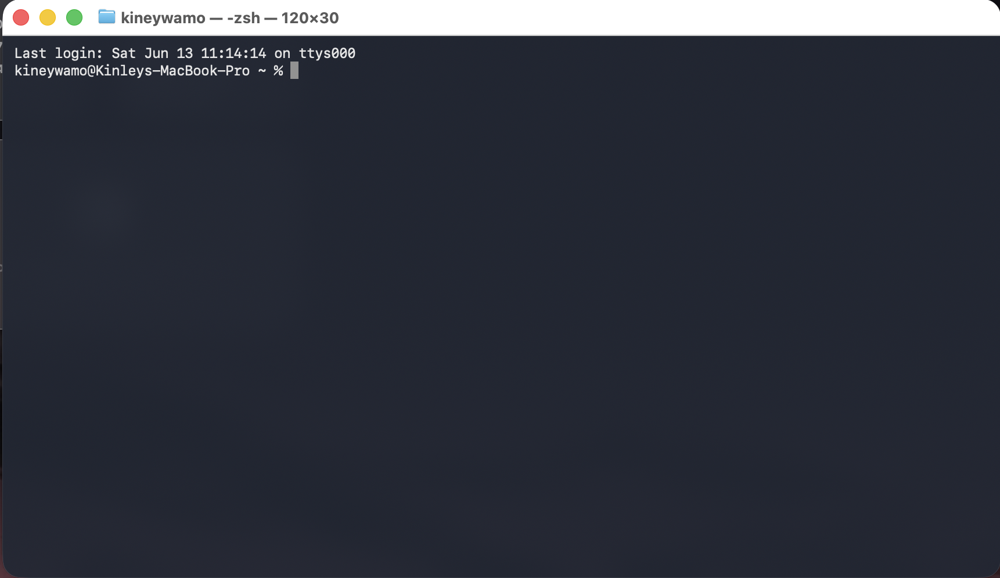
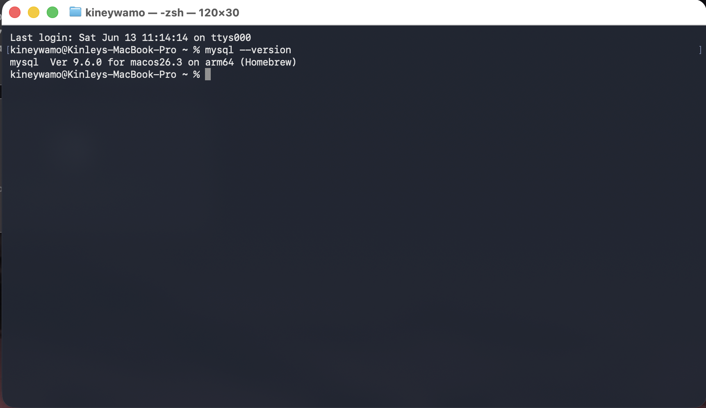
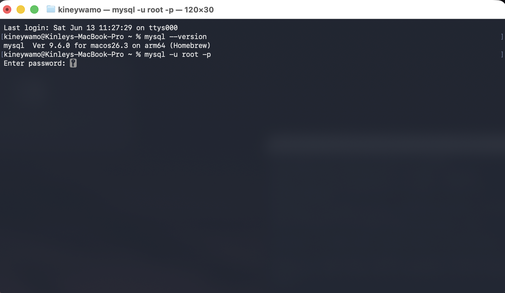
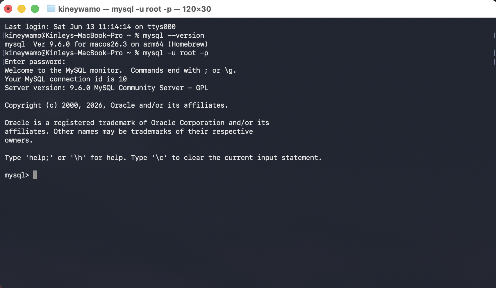
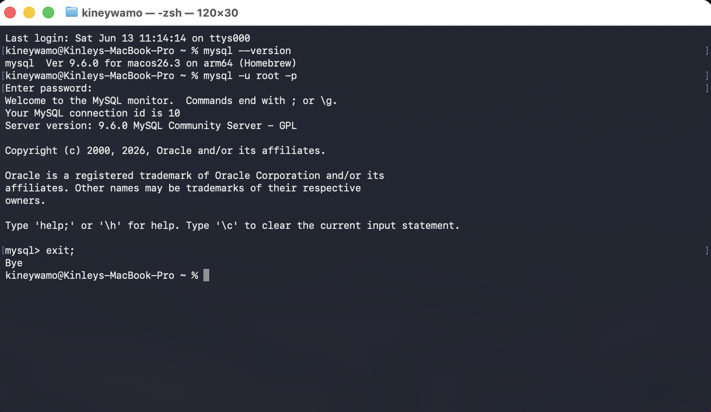

# Practical 1: Verification and Access of MySQL on macOS

## Aim

To verify the installation of MySQL on macOS and successfully access the MySQL server through the Terminal.

---

## Software Requirements

* macOS
* Terminal
* MySQL Community Server

---

## Theory

MySQL is an open-source Relational Database Management System (RDBMS) that stores and manages data in tables. It uses Structured Query Language (SQL) to create, retrieve, update, and delete data. MySQL is widely used in web applications and enterprise systems because it is reliable, efficient, and easy to use.

On macOS, MySQL can be accessed through the Terminal by connecting to the MySQL server using a valid user account.

---

## Implementation Steps

### Step 1: Open Terminal

Open the **Terminal** application from your Mac.



---

### Step 2: Verify MySQL Installation

Run the following command:

```bash
mysql --version
```

If MySQL is installed correctly, it will display the installed version.



```text
mysql Ver 9.6.0 for macos26.3 on arm64 (Homebrew)
```

---

### Step 3: Connect to MySQL Server

Enter the following command:

```bash
mysql -u root -p
```

Press **Enter** and provide the root password when prompted.



---

### Step 4: Successfully Access the MySQL Monitor

After entering the correct password, the MySQL monitor opens successfully and displays information about the server.

You should see output similar to:

```text
Welcome to the MySQL monitor.

Server version: 9.6.0 MySQL Community Server - GPL

mysql>
```

This confirms that the MySQL server is running and ready to execute SQL commands.



---

### Step 5: Exit MySQL

After verifying the connection, exit the MySQL monitor by typing:

```sql
exit;
```

or

```sql
quit;
```

You should return to the normal Terminal prompt.



```text
kineywamo@Kinleys-MacBook-Pro ~ %
```

---

## Commands Used

```bash
mysql --version

mysql -u root -p
```

```sql
exit;
```

---

## Result

The MySQL installation was successfully verified, and a connection to the MySQL server was established through the Terminal. The server responded correctly and allowed access to the MySQL command-line interface.

---

## Conclusion

This practical demonstrated how to verify the MySQL installation and connect to the MySQL server using Terminal commands on macOS. Successfully accessing the MySQL monitor confirms that the database environment is properly configured and ready for executing SQL queries in future practical sessions.
