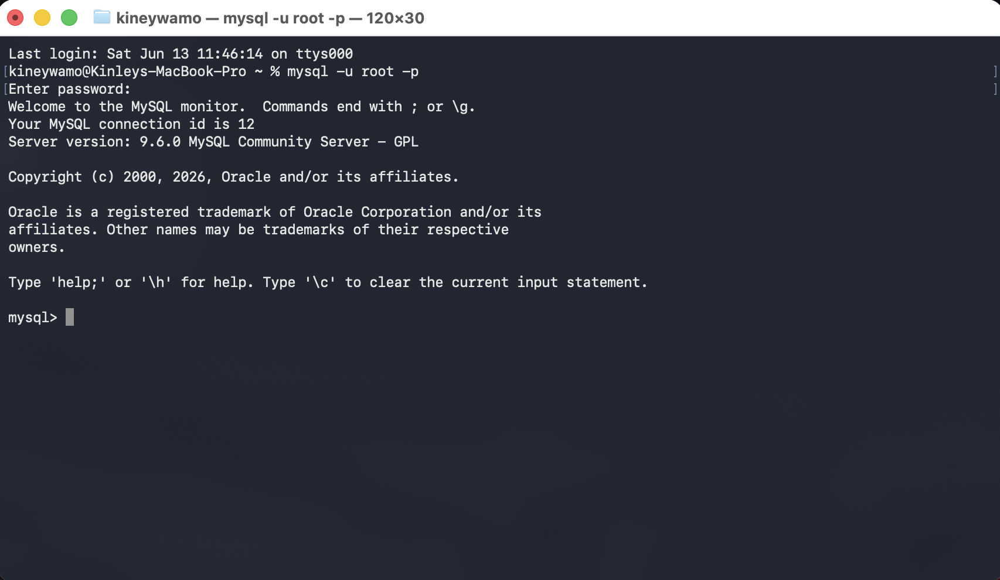
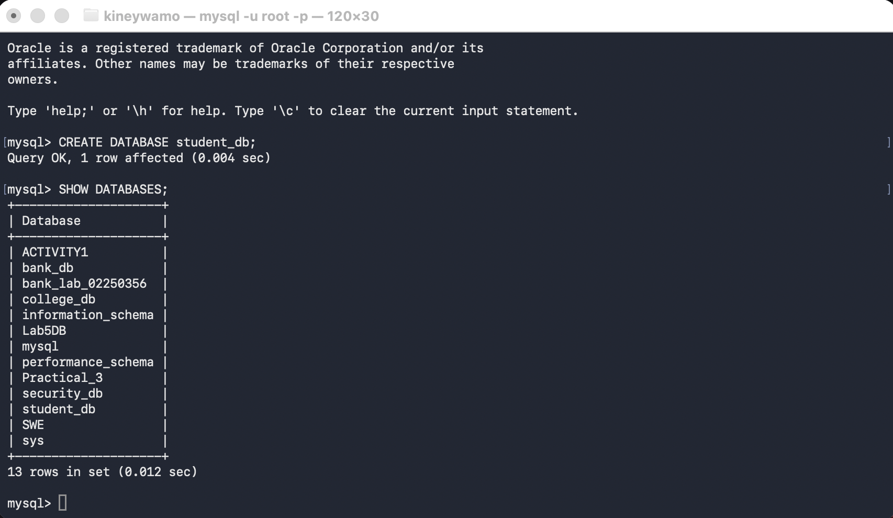
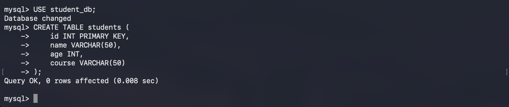
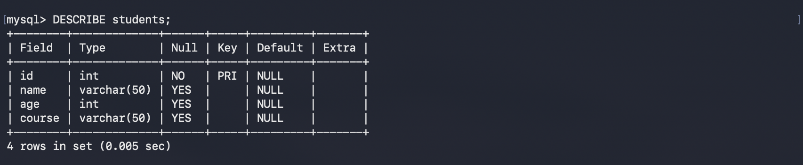
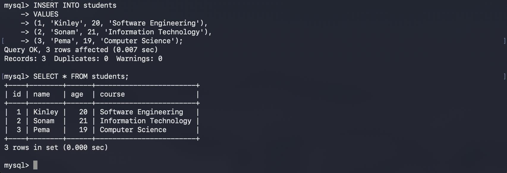
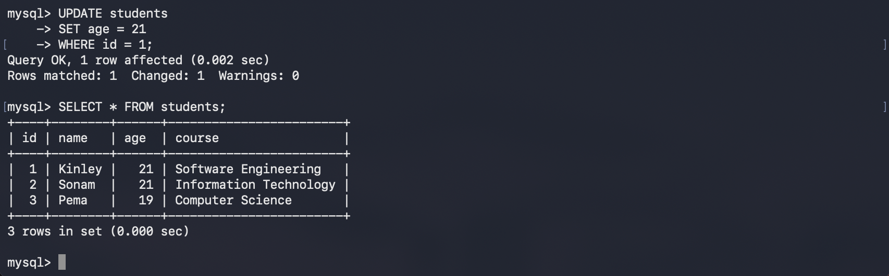
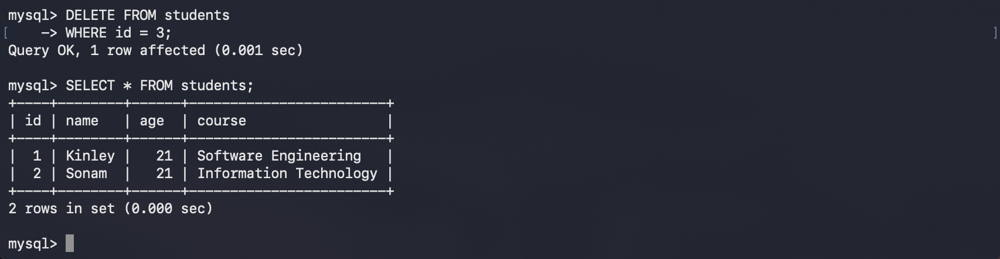

# Practical 2: Executing Basic SQL Queries

## Aim

To understand and implement basic SQL operations using MySQL, including `CREATE`, `INSERT`, `SELECT`, `UPDATE`, and `DELETE` statements.

---

## Software Requirements

* macOS
* Terminal
* MySQL Community Server

---

## Theory

Structured Query Language (SQL) is the standard language used to communicate with relational databases. It enables users to create databases and tables, insert records, retrieve information, modify existing data, and delete unwanted records.

The basic SQL statements covered in this practical are:

* `CREATE` – Creates a new database or table.
* `INSERT` – Adds new records into a table.
* `SELECT` – Retrieves data from a table.
* `UPDATE` – Modifies existing records.
* `DELETE` – Removes records from a table.

---

## Implementation Steps

### Step 1: Log in to MySQL

Open Terminal and connect to MySQL.

```bash
mysql -u root -p
```

Enter your root password.



---

### Step 2: Create a Database

Create a new database named `student_db`.

```sql
CREATE DATABASE student_db;
```

Verify that the database has been created.

```sql
SHOW DATABASES;
```



---

## Step 3: Use the Database

Select the database for further operations.

```sql
USE student_db;
```


```text
Database changed
```

---

## Step 4: Create a Table

Create a table named `students`.

```sql
CREATE TABLE students (
    id INT PRIMARY KEY,
    name VARCHAR(50),
    age INT,
    course VARCHAR(50)
);
```


Check the table structure.

```sql
DESCRIBE students;
```



---

## Step 5: Insert Records

Insert sample records into the table.

```sql
INSERT INTO students
VALUES
(1, 'Kinley', 20, 'Software Engineering'),
(2, 'Sonam', 21, 'Information Technology'),
(3, 'Pema', 19, 'Computer Science');
```

View the inserted data.

```sql
SELECT * FROM students;
```



---

## Step 6: Update Data

Update Kinley's age.

```sql
UPDATE students
SET age = 21
WHERE id = 1;
```

Verify the update.

```sql
SELECT * FROM students;
```



---

## Step 7: Delete a Record

Delete the record with `id = 3`.

```sql
DELETE FROM students
WHERE id = 3;
```

Verify the deletion.

```sql
SELECT * FROM students;
```



---

# SQL Commands Used

```sql
CREATE DATABASE student_db;

SHOW DATABASES;

USE student_db;

CREATE TABLE students (
    id INT PRIMARY KEY,
    name VARCHAR(50),
    age INT,
    course VARCHAR(50)
);

DESCRIBE students;

INSERT INTO students
VALUES
(1, 'Kinley', 20, 'Software Engineering'),
(2, 'Sonam', 21, 'Information Technology'),
(3, 'Pema', 19, 'Computer Science');

SELECT * FROM students;

UPDATE students
SET age = 21
WHERE id = 1;

DELETE FROM students
WHERE id = 3;
```

---

# Result

The database and table were successfully created. Records were inserted, retrieved, updated, and deleted using basic SQL statements. All operations executed successfully in MySQL.

---

# Conclusion

This practical provided hands-on experience with the fundamental SQL operations required for database management. By performing `CREATE`, `INSERT`, `SELECT`, `UPDATE`, and `DELETE` operations, a basic understanding of data manipulation and retrieval in MySQL was achieved.
