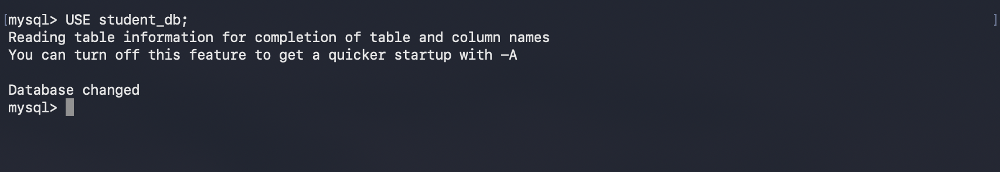
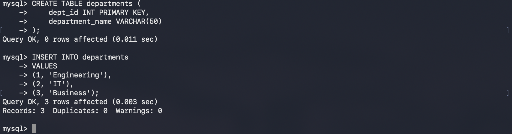
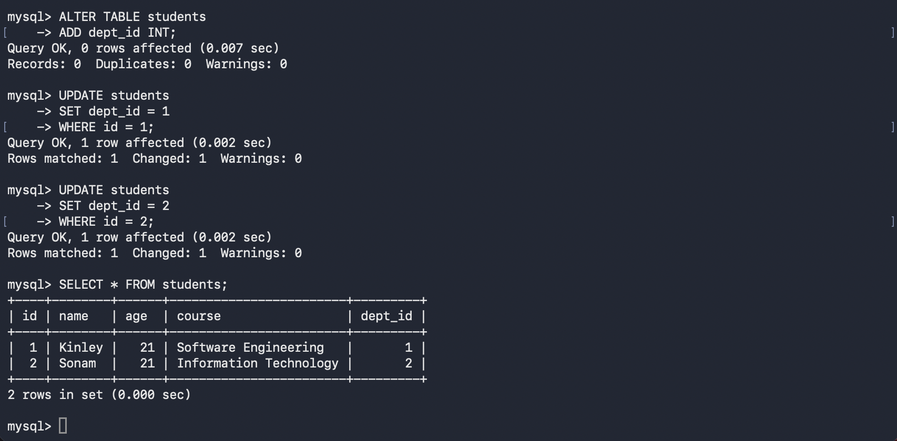
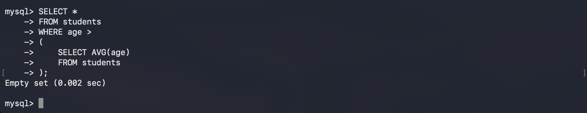
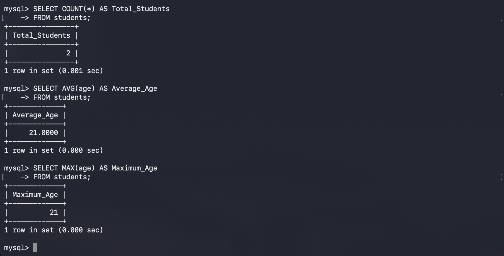
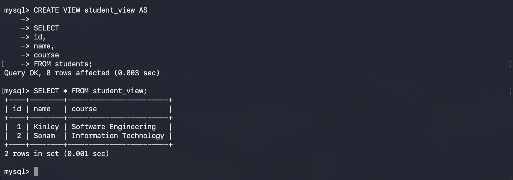
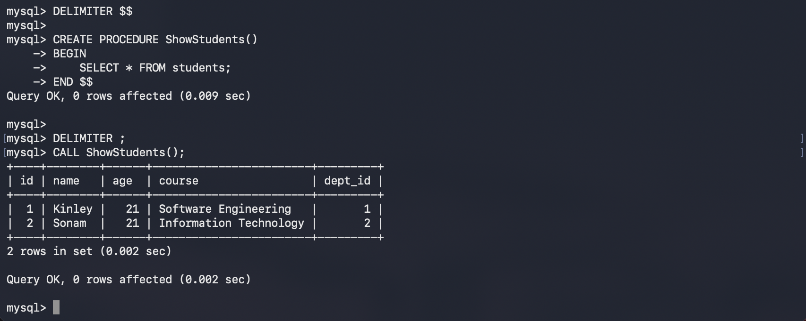

# Practical 3: Executing Advanced SQL Queries

## Aim

To understand and implement advanced SQL queries using MySQL, including `JOIN`, subqueries, aggregate functions, views, and stored procedures.

---

## Software Requirements

* macOS
* Terminal
* MySQL Community Server

---

## Theory

Advanced SQL queries allow users to retrieve and manipulate data more efficiently. They are useful when working with multiple tables and performing complex operations.

The concepts covered in this practical include:

* **JOIN** – Combines records from multiple tables.
* **Subquery** – A query nested inside another query.
* **Aggregate Functions** – Performs calculations such as `COUNT()`, `SUM()`, `AVG()`, `MAX()`, and `MIN()`.
* **VIEW** – A virtual table created from an SQL query.
* **Stored Procedure** – A saved collection of SQL statements that can be executed repeatedly.

---

## Implementation Steps

### Step 1: Log in to MySQL

Open Terminal and connect to MySQL.

```bash
mysql -u root -p
```

Enter your password.


---

### Step 2: Select the Database

```sql
USE student_db;
```



```text
Database changed
```

---

### Step 3: Create the `departments` Table

```sql
CREATE TABLE departments (
    dept_id INT PRIMARY KEY,
    department_name VARCHAR(50)
);
```

Insert sample data.

```sql
INSERT INTO departments
VALUES
(1, 'Engineering'),
(2, 'IT'),
(3, 'Business');
```



---

### Step 4: Add Department ID to Students Table

```sql
ALTER TABLE students
ADD dept_id INT;
```

Update existing records.

```sql
UPDATE students
SET dept_id = 1
WHERE id = 1;

UPDATE students
SET dept_id = 2
WHERE id = 2;
```

View the table.

```sql
SELECT * FROM students;
```



---

### Step 5: Perform an INNER JOIN

```sql
SELECT
students.id,
students.name,
departments.department_name
FROM students
INNER JOIN departments
ON students.dept_id = departments.dept_id;
```


---

### Step 6: Execute a Subquery

Display students older than the average age.

```sql
SELECT *
FROM students
WHERE age >
(
    SELECT AVG(age)
    FROM students
);
```



---

### Step 7: Use Aggregate Functions

Count total students.

```sql
SELECT COUNT(*) AS Total_Students
FROM students;
```

Calculate average age.

```sql
SELECT AVG(age) AS Average_Age
FROM students;
```

Find maximum age.

```sql
SELECT MAX(age) AS Maximum_Age
FROM students;
```



---

### Step 8: Create a View

```sql
CREATE VIEW student_view AS

SELECT
id,
name,
course
FROM students;
```

Display the view.

```sql
SELECT * FROM student_view;
```



---

### Step 9: Create a Stored Procedure

```sql
DELIMITER $$

CREATE PROCEDURE ShowStudents()
BEGIN
    SELECT * FROM students;
END $$

DELIMITER ;
```

Execute the procedure.

```sql
CALL ShowStudents();
```



---

## SQL Commands Used

```sql
USE student_db;

CREATE TABLE departments (
    dept_id INT PRIMARY KEY,
    department_name VARCHAR(50)
);

INSERT INTO departments
VALUES
(1, 'Engineering'),
(2, 'IT'),
(3, 'Business');

ALTER TABLE students
ADD dept_id INT;

UPDATE students
SET dept_id = 1
WHERE id = 1;

UPDATE students
SET dept_id = 2
WHERE id = 2;

SELECT
students.id,
students.name,
departments.department_name
FROM students
INNER JOIN departments
ON students.dept_id = departments.dept_id;

SELECT *
FROM students
WHERE age >
(
    SELECT AVG(age)
    FROM students
);

SELECT COUNT(*) FROM students;

SELECT AVG(age) FROM students;

SELECT MAX(age) FROM students;

CREATE VIEW student_view AS
SELECT id, name, course
FROM students;

SELECT * FROM student_view;

DELIMITER $$

CREATE PROCEDURE ShowStudents()
BEGIN
    SELECT * FROM students;
END $$

DELIMITER ;

CALL ShowStudents();
```

---

## Result

Advanced SQL operations including `JOIN`, subqueries, aggregate functions, views, and stored procedures were successfully implemented and executed in MySQL.

---

## Conclusion

This practical enhanced the understanding of advanced SQL concepts used in relational database systems. By performing joins, nested queries, aggregate operations, creating views, and defining stored procedures, more efficient and reusable database operations were achieved.
