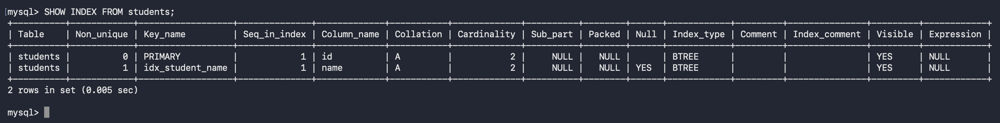
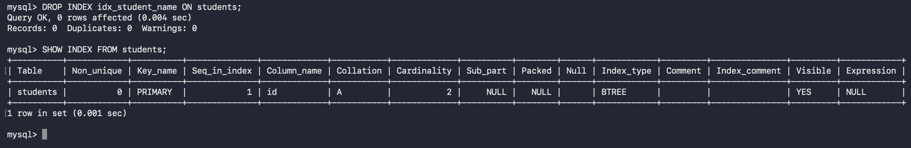

# Practical 6: Implementing Indexing for Faster Query Retrieval

## Aim

To understand and implement indexing in MySQL to improve the speed and efficiency of data retrieval operations.

---

## Software Requirements

* macOS
* Terminal
* MySQL Community Server

---

## Theory

An index is a database object that improves the speed of data retrieval from a table. Instead of scanning every row in a table, MySQL can use an index to quickly locate the required records.

Indexes are commonly created on columns that are frequently used in:

* `WHERE` clauses
* `ORDER BY` clauses
* `JOIN` conditions

Although indexes improve query performance, they require additional storage and may slightly slow down `INSERT`, `UPDATE`, and `DELETE` operations because the index must also be updated.

---

## Implementation Steps

### Step 1: Log in to MySQL

Open Terminal and log in.

```bash
mysql -u root -p
```

Enter your password.


---

### Step 2: Select the Database

```sql
USE student_db;
```


```text
Database changed
```

---

### Step 3: Display Existing Data

Check the records available in the `students` table.

```sql
SELECT * FROM students;
```

This confirms that data exists before creating an index.


---

### Step 4: Create an Index

Create an index on the `name` column.

```sql
CREATE INDEX idx_student_name
ON students(name);
```

If successful, MySQL will display:

```text
Query OK
```


---

### Step 5: Display Existing Indexes

Execute:

```sql
SHOW INDEX FROM students;
```

This displays all indexes created for the `students` table.



---

### Step 6: Execute a Query Using the Indexed Column

Search for a student by name.

```sql
SELECT *
FROM students
WHERE name = 'Kinley';
```

The query retrieves records efficiently using the created index.


---

### Step 7: Remove the Index

Delete the created index.

```sql
DROP INDEX idx_student_name
ON students;
```

Verify that it has been removed.

```sql
SHOW INDEX FROM students;
```



---

## SQL Commands Used

```sql
USE student_db;

SELECT * FROM students;

CREATE INDEX idx_student_name
ON students(name);

SHOW INDEX FROM students;

SELECT *
FROM students
WHERE name = 'Kinley';

DROP INDEX idx_student_name
ON students;

SHOW INDEX FROM students;
```

---

## Result

An index was successfully created on the `name` column of the `students` table. The index was verified using `SHOW INDEX`, utilized in a search query, and later removed successfully.

---

## Conclusion

This practical demonstrated how indexing can improve query performance in MySQL. By creating and managing indexes, data retrieval becomes more efficient, especially for frequently searched columns.
