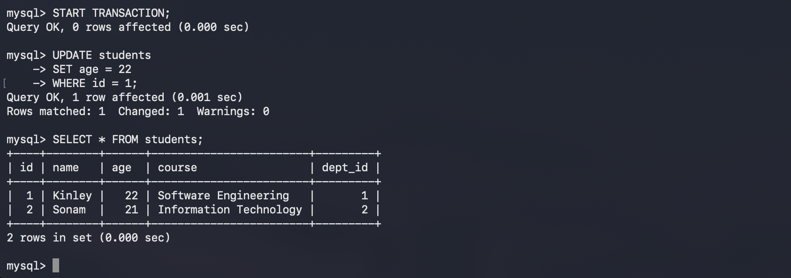
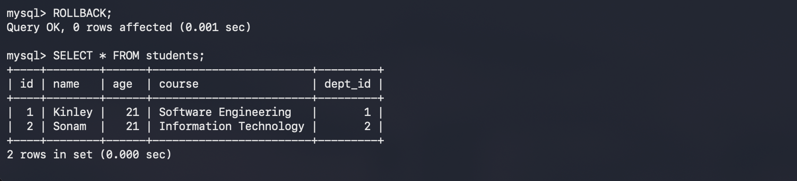
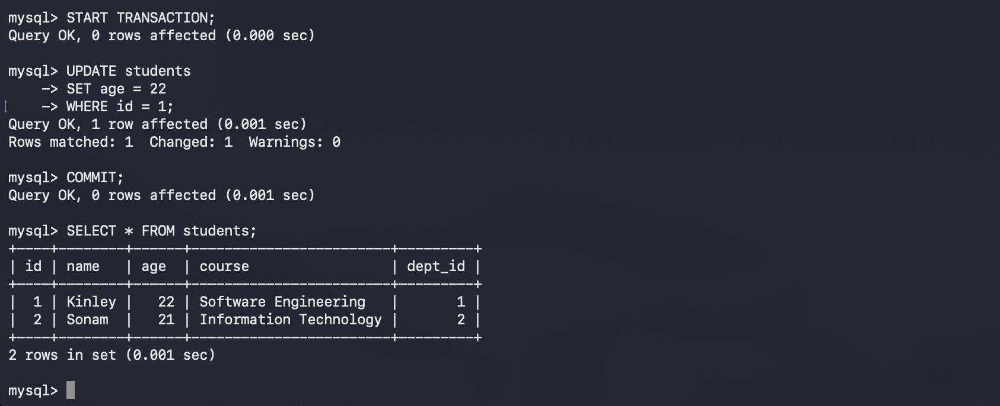

# Practical 7: Executing Transactions in MySQL

## Aim

To understand and implement transactions in MySQL using `START TRANSACTION`, `COMMIT`, and `ROLLBACK` statements.

---

## Software Requirements

* macOS
* Terminal
* MySQL Community Server

---

## Theory

A transaction is a sequence of one or more SQL operations that are executed as a single unit of work. Transactions help maintain data integrity by ensuring that either all operations succeed or none of them are applied.

Important transaction commands:

* `START TRANSACTION` – Begins a new transaction.
* `COMMIT` – Saves all changes permanently.
* `ROLLBACK` – Cancels all changes made during the current transaction.

Transactions follow the **ACID** properties:

* **Atomicity** – All operations succeed or fail together.
* **Consistency** – The database remains in a valid state.
* **Isolation** – Transactions do not interfere with each other.
* **Durability** – Committed changes are permanently stored.

---

## Implementation Steps

### Step 1: Log in to MySQL

Open Terminal and connect to MySQL.

```bash
mysql -u root -p
```

Enter your password.


---

### Step 2: Select the Database

```sql
USE student_db;
```


```text
Database changed
```

---

### Step 3: Display Existing Records

Check the current contents of the `students` table.

```sql
SELECT * FROM students;
```


---

### Step 4: Start a Transaction

Begin a new transaction.

```sql
START TRANSACTION;
```

Update a student's age.

```sql
UPDATE students
SET age = 22
WHERE id = 1;
```

Check the updated value.

```sql
SELECT * FROM students;
```



---

### Step 5: Roll Back the Transaction

Cancel the changes.

```sql
ROLLBACK;
```

Verify that the original value has been restored.

```sql
SELECT * FROM students;
```



---

### Step 6: Start Another Transaction

Begin another transaction.

```sql
START TRANSACTION;
```

Update the student's age again.

```sql
UPDATE students
SET age = 22
WHERE id = 1;
```

Save the changes permanently.

```sql
COMMIT;
```

Display the table.

```sql
SELECT * FROM students;
```



---

## SQL Commands Used

```sql
USE student_db;

SELECT * FROM students;

START TRANSACTION;

UPDATE students
SET age = 22
WHERE id = 1;

SELECT * FROM students;

ROLLBACK;

SELECT * FROM students;

START TRANSACTION;

UPDATE students
SET age = 22
WHERE id = 1;

COMMIT;

SELECT * FROM students;
```

---

## Result

Transactions were successfully executed using `START TRANSACTION`, `ROLLBACK`, and `COMMIT`. The rollback operation reverted temporary changes, while the commit operation permanently saved the modifications.

---

## Conclusion

This practical demonstrated the importance of transactions in maintaining database consistency. Using `ROLLBACK` allows unwanted changes to be discarded, while `COMMIT` permanently stores successful operations, ensuring reliable database management.
