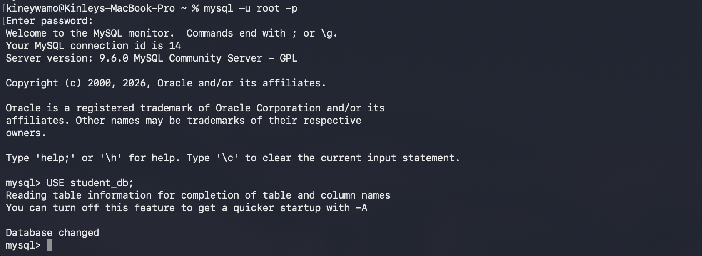
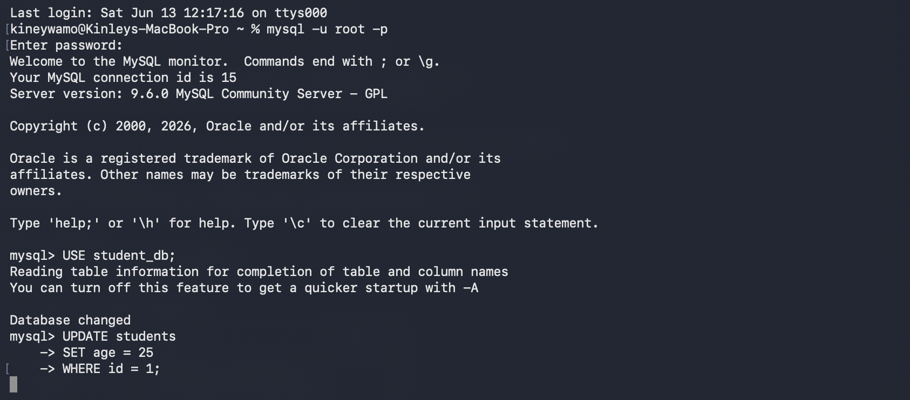

# Practical 8: Implementing Concurrency Control Using Locking

## Aim

To understand and demonstrate concurrency control in MySQL by using table locking mechanisms during multiple transactions.

---

## Software Requirements

* macOS
* Terminal
* MySQL Community Server

---

## Theory

Concurrency control is a mechanism that ensures multiple users can access the database simultaneously without causing inconsistencies.

One common method of concurrency control is **locking**. A lock prevents other users or transactions from modifying data while it is being used by another transaction.

Types of locks include:

* **READ Lock** – Allows other users to read the table but prevents modifications.
* **WRITE Lock** – Prevents other users from reading or writing until the lock is released.

Locking helps maintain data consistency and prevents conflicts between concurrent transactions.

---

## Implementation Steps

### Step 1: Open the First Terminal Window

Open Terminal and log in to MySQL.

```bash
mysql -u root -p
```

Select the database.

```sql
USE student_db;
```



---

### Step 2: Lock the Students Table

Execute the following command in the first Terminal window.

```sql
LOCK TABLES students WRITE;
```

The `students` table is now locked for writing.


---

### Step 3: Verify That the Table Can Still Be Accessed

Run:

```sql
SELECT * FROM students;
```

The query should execute successfully because the same session owns the lock.


---

### Step 4: Open a Second Terminal Window

Open another Terminal window.

Log in again.

```bash
mysql -u root -p
```

Select the same database.

```sql
USE student_db;
```

Attempt to update the locked table.

```sql
UPDATE students
SET age = 25
WHERE id = 1;
```

Since the first session holds the write lock, the second session will wait until the lock is released.



---

### Step 5: Release the Lock

Return to the first Terminal window.

Execute:

```sql
UNLOCK TABLES;
```

The lock is now released.


---

### Step 6: Retry the Update

Return to the second Terminal window.

The pending update should now complete successfully.

Verify the updated data.

```sql
SELECT * FROM students;
```


---

## SQL Commands Used

```sql
USE student_db;

LOCK TABLES students WRITE;

SELECT * FROM students;

UNLOCK TABLES;

UPDATE students
SET age = 25
WHERE id = 1;

SELECT * FROM students;
```

---

## Result

The `students` table was successfully locked using a write lock. While the lock was active, another session was unable to modify the table. After releasing the lock with `UNLOCK TABLES`, the pending operation completed successfully.

---

## Conclusion

This practical demonstrated how locking mechanisms provide concurrency control in MySQL. By using table locks, multiple transactions can be coordinated safely, preventing conflicting updates and ensuring database consistency.
