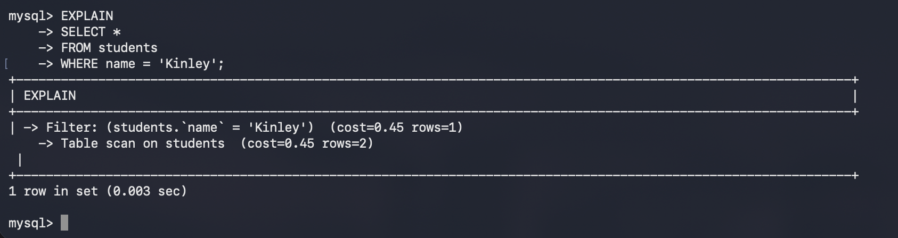
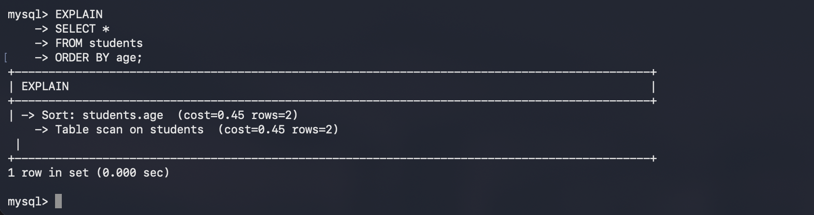

# Practical 9: Query Optimization Using EXPLAIN

## Aim

To analyze SQL query execution plans and understand how query optimization improves database performance using the `EXPLAIN` statement in MySQL.

---

## Software Requirements

* macOS
* Terminal
* MySQL Community Server

---

## Theory

Query optimization is the process of improving the performance of SQL queries by selecting the most efficient execution plan.

MySQL provides the `EXPLAIN` statement to display information about how a query will be executed. It helps developers understand:

* Which table is accessed first.
* Whether indexes are used.
* The access method used for retrieving data.
* The estimated number of rows scanned.

By analyzing query execution plans, developers can optimize database performance and reduce query execution time.

---

## Implementation Steps

### Step 1: Log in to MySQL

Open Terminal and log in to MySQL.

```bash
mysql -u root -p
```

Enter your password.


---

### Step 2: Select the Database

```sql
USE student_db;
```


```text
Database changed
```

---

### Step 3: Display Existing Records

Verify that the `students` table contains data.

```sql
SELECT * FROM students;
```


---

### Step 4: Analyze a Query Using EXPLAIN

Execute:

```sql
EXPLAIN
SELECT *
FROM students
WHERE name = 'Kinley';
```

MySQL will display the execution plan for the query.



---

### Step 5: Execute the Query

Run the actual query.

```sql
SELECT *
FROM students
WHERE name = 'Kinley';
```

Compare the result with the execution plan.


---

### Step 6: Analyze a Query with ORDER BY

Execute:

```sql
EXPLAIN
SELECT *
FROM students
ORDER BY age;
```

Observe how MySQL plans to execute the sorting operation.



---

### Step 7: Execute the ORDER BY Query

```sql
SELECT *
FROM students
ORDER BY age;
```

Verify the sorted records.


---

## SQL Commands Used

```sql
USE student_db;

SELECT * FROM students;

EXPLAIN
SELECT *
FROM students
WHERE name = 'Kinley';

SELECT *
FROM students
WHERE name = 'Kinley';

EXPLAIN
SELECT *
FROM students
ORDER BY age;

SELECT *
FROM students
ORDER BY age;
```

---

## Result

The `EXPLAIN` statement successfully displayed the execution plans for SQL queries. The queries were analyzed and executed, providing insight into how MySQL processes and optimizes data retrieval.

---

## Conclusion

This practical demonstrated how query optimization can be analyzed using the `EXPLAIN` statement. Understanding execution plans helps developers write more efficient SQL queries, improve database performance, and reduce unnecessary resource usage.
